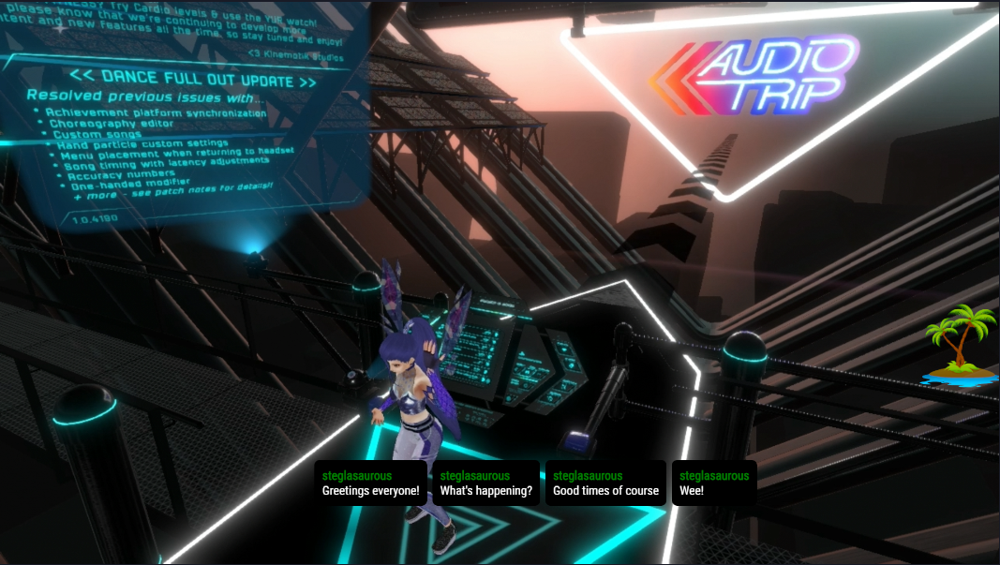

# StegChat: A Twitch chat overlay

Other overlays didn't _quite_ do what I wanted, so I made one. :)  This chat overlay shows messages horizontally on the screen.  Supports the usual twitch emotes.



If others find this useful, I may extend its abilities, customization, etc., but also welcome contributors!

**NOTE: This is super-duper alpha. I will be cleaning up the code over the coming weeks for more general consumption.**

## Requirements

- If building the app yourself, you'll need node.js v16.x or better.

## Usage

### Quickstart

TBD: Using a hosted URL - not yet provisioned.

Pass in the channels you want the overlay to show messages for with a comma-delimited channels query string parameter.  Ex:

`http://localhost:4200?channels=steglasaurous,steg_bot`

In most cases, you probably only want your own channel, however it can be useful in multistreams to show multiple channels' chat messages in one overlay.  

### Advanced (or building it yourself)

Start with installing dependencies:

```
npm install
```

To serve the app from the default http://localhost:4200 :

```
npx ng serve
```

# TODO

- [ ]  Add parameter `websocket_host` to configure where to connect to streamer.bot's websocket server, remove hard-coded value.
- [ ]  BUG: Message boxes change shape to fit in their container - should maintain their original shape and push other messages off-screen.
- [ ]  BUG: Messages that contain URLs or other text without spaces go past their box boundaries and trample the next chat message box.
